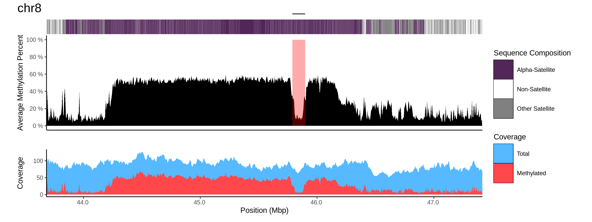

# CDR-Finder
[](https://github.com/koisland/CDR-Finder/actions/workflows/main.yaml)

This repository contains a Snakemake workflow to identify and quantify hypomethylated regions within centromeres, or Centromere Dip Regions (CDRs; Altemose et al., Science, 2022).



Original pipeline constructed by @arozanski97 with help from Glennis Logsdon

Adapted and distributed by @fkmastrorosa, @wharvey31, and @koisland.

This is done by:
- Extracting the sequence of interest
- Intersect the sequence with its methylation data
- Bin the region of interest into 5 kbp windows and calculate their mean methylation percentage
- Run RepeatMasker on the sequence of interest to identify regions containing alpha-satellite repeats (ALR/Alpha)
- For each alpha-satellite containing region:
    * Merge consecutive bins.
    * Detect valleys in average methylation percentage.
    * Optionally, merge adjacent detected CDRs.


## Getting Started
```bash
git clone https://github.com/koisland/CDR-Finder
cd CDR-Finder
```

To setup with `conda`:
```bash
conda env create --name cdr_finder -f env.yaml
conda activate cdr_finder
```

If using `singularity`, only `snakemake` is required. This will create a python virtual environment and install `snakemake`.
```bash
python -m venv venv && source venv/bin/activate
pip install snakemake
```

## Usage
To run with `conda`.
```bash
snakemake -np --sdm conda -c 4
```

To run with `singularity`. This will use [`logsdonlab/cdr-finder`](https://hub.docker.com/r/logsdonlab/cdr-finder) to run the workflow.
```bash
snakemake -np --sdm apptainer conda  -c 4
```

Or alternatively to add as a workflow to an existing Snakefile.
```bash
git submodule add https://github.com/koisland/CDR-Finder
```

```python
# Pass CDR config here.
CDR_CONFIG = {}

module CDRFinder:
    snakefile:
        "CDR-Finder/workflow/Snakefile"
    config:
        CDR_CONFIG

use rule * from CDRFinder as cdr_*

rule all:
    input:
        rules.cdr_all.input
```

## Input
Multiple samples can be provided via the configfile. Each sample should contain the following:
- `fasta`
    * Genome assembly.
- `bamfile`
    * Alignment BAM file with methylation tags.
    * Requires aligned reads with the Mm and Ml tags (MM and ML also supported), and the reference sequence used for alignment.
    * PacBio data requires that the alignment does not hard-clip supplementary alignment using `pbmm2` or -Y flag for `minimap2`/`winnowmap`.
    * https://github.com/epi2me-labs/modbam2bed?tab=readme-ov-file#usage
- `regions`
    * BED file of target region coordinates.

## Output
- `cdr_bed`
    * CDR regions.
    * Based on the mean methylation frequency across the region, identifies and bins regions into `config.window_size` with methylation frequency below mean spanning `config.report_threshold`.
    * `{config.output_dir}/bed/{sample}_CDR.bed`
- `cdr_plot`
    * CDR regions plotted with RepeatMasker annotations.
    * `{config.output_dir}/plot/{sample}_CDR.png`

## Parameters
|parameter|description|default|
|-|-|-|
|`window_size`|Size of the methylation windows to average over.|5000|
|`alr_threshold`|Size of ALR repeat stretches to include in search of CDR.|100,000|
|`bp_merge`| Distance in bases to merge adjacent CDRs. Can be omitted.|1|
|`quantile_valley_threshold`|Threshold quantile to filter low confidence CDRs. Smaller values filter for more valleys with lower methyl percents.|0.1|
|`prominence_perc_valley_threshold`|Threshold percent of the maximum methylation percentage as the minimal [prominence](https://en.wikipedia.org/wiki/Topographic_prominence) of a valley to filter low confidence CDRs. Larger values filter for deeper valleys.|0.33|

## Testing
Set up conda environment.
```bash
conda env create --name test_cdr_finder -f env_dev.yaml
```

To run the test case on chr8 and chr21.
```bash
snakemake -c 1 -p --sdm conda --configfile test/config/config.yaml
```

To run integration tests.
```bash
pytest -vvv
```

## Containerization
Requires `root` user and `docker`.
```bash
make docker
```

```bash
make singularity
```
