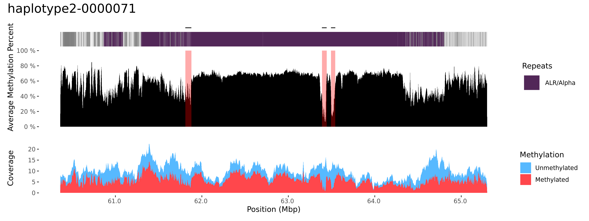
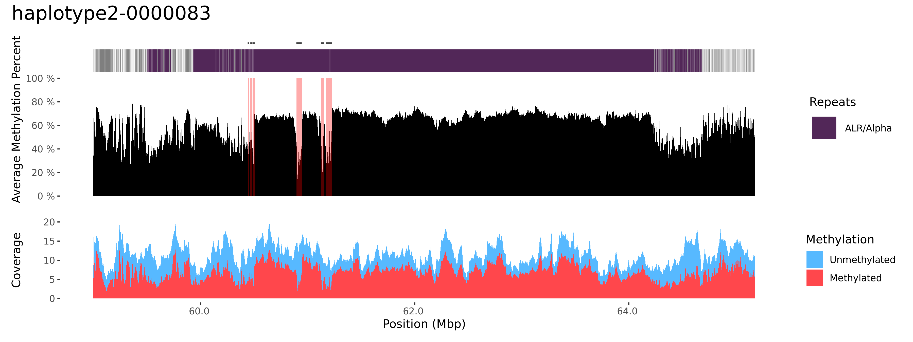
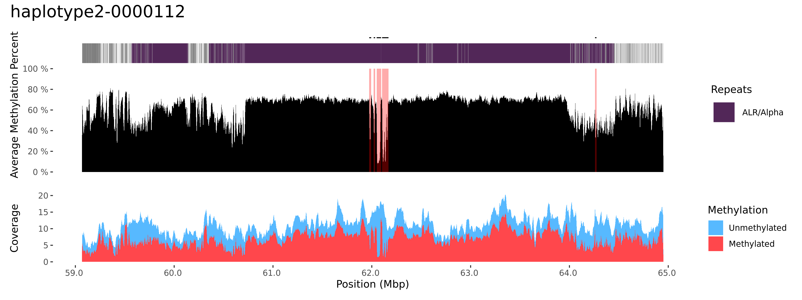
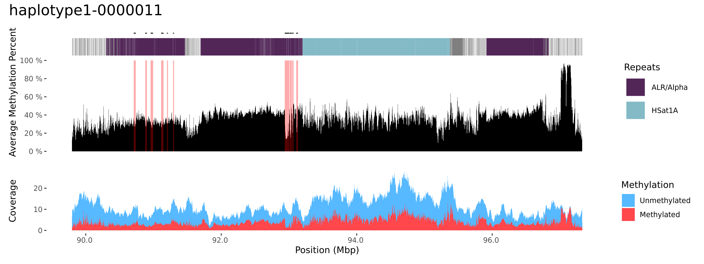
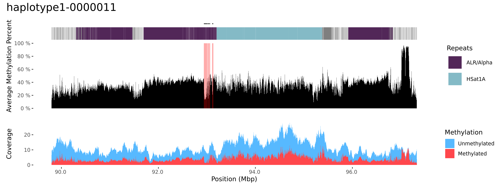
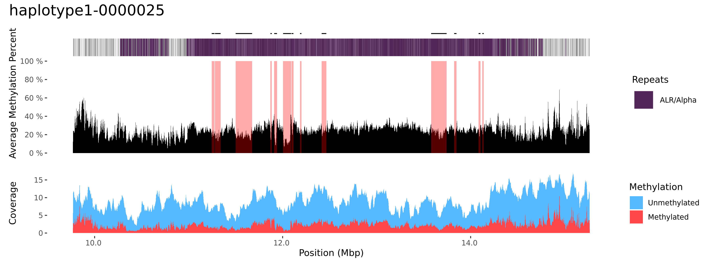
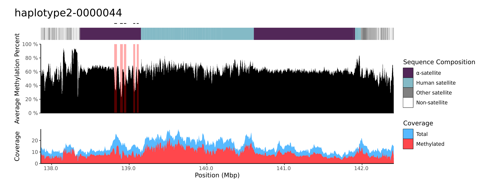
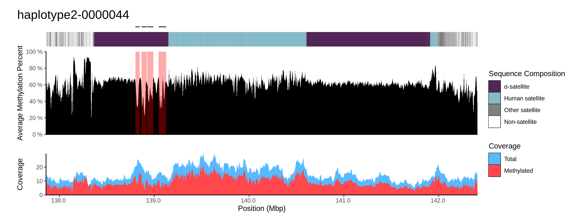
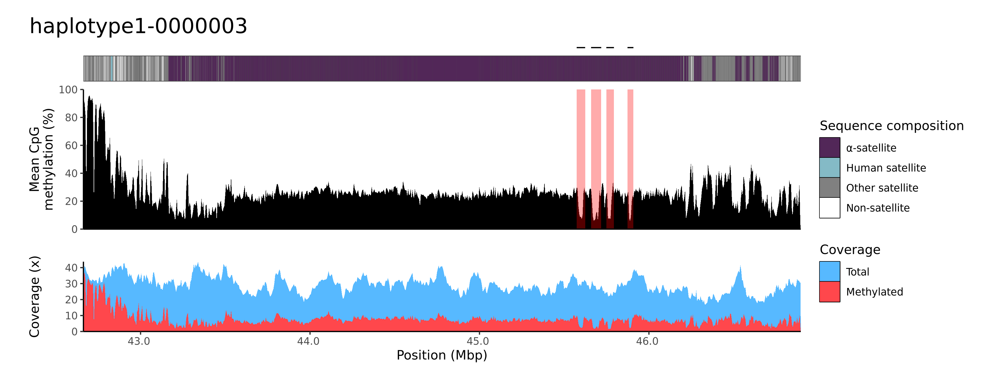
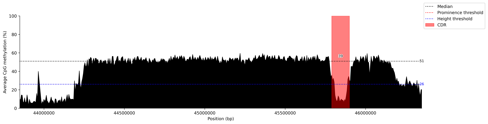

# Issues
CDR-Finder may fail to correctly call the correct regions. Choosing the correct set of parameters may fix similar scenarios.

Examples:
1. [Pericentromeric/centromeric transition regions](#pericentromericcentromeric-transition-regions)
2. [Low, uniform average methylation percent](#low-uniform-average-methylation-percent)
3. [Smaller dip regions](#smaller-dip-regions)
4. [Missing non-prominent CDRs](#missing-non-prominent-cdrs)
5. [Scaling by average methylation percent](#scaling-by-average-methylation-percent)

### Pericentromeric/centromeric transition regions
Regions on the edges may get falsely called due to rapid changes in methylation.




Increasing `height_perc_valley_threshold` and `window_size` may reduce these cases by:
* Requiring deeper valleys. (`height_perc_valley_threshold`)
* Smoothing noisy peaks/valleys. (`window_size`)

### Low, uniform average methylation percent
Low and uniform average methylation percent may result in false calls.

With a `prom_perc_valley_threshold` of `0.2` and default parameters.



Increasing `prom_perc_valley_threshold` to `0.3` correctly ignores non-prominent CDRs.



### Smaller dip regions
These can be filtered by increasing the required height of a CDR.

With `height_perc_valley_threshold` of `0.34` and default parameters.


Requiring 60% of the median methylation average with `height_perc_valley_threshold` at `0.6` fixes this issue.


### Missing non-prominent CDRs
To include these, use `--extend_edges_std`. This extends the edges of existing CDRs until the mean plus some number of standard deviations is reached.
* We use the mean as it's more sensitive to outliers. These dips in methylation within the CDR will reduce the mean and prevent falsely including non CDR regions.

> [!Note]
> This has a similar effect to `--bp_merge` and may merge over peaks. Reduce the value to prevent this.

Don't extend.


Extend until the mean.


Extend until the 1 stdev below the mean.


### Scaling by average methylation percent
With centromeres like chr11 with low average methylation percent, the parameter `baseline_avg_methyl` can help in reducing false-positives without manual parameter adjusting.
This will scale the height and prominence thresholds based on the ratio of the average methyl percent and the given baseline.

Default Thresholds


New Thresholds


* The average methyl coverage is 0.2
* The `baseline_avg_methyl` is 0.4
* Thresholds:
    * `height_perc_valley_threshold` is 0.34
    * `prom_perc_valley_threshold` is 0.3
* Adjustment factor:
    * `0.4 / 0.2 = 2`
* New thresholds:
    * `height_perc_valley_threshold` is 0.68
    * `prom_perc_valley_threshold` is 0.6

### Debugging/Manual curation
CDR-Finder will work optimally in human centromeres barring cases with:
* Misassemblies
* Non-uniform coverage

To facilitate debugging, the `cdr_finder.py` script can be rerun separately and produce simple line plots to test different thresholds.

```bash
python workflow/scripts/cdr_finder.py \
-i results/bed/CHM13_merged_methyl.bed \
--thr_height_perc_valley 0.34 \
--bp_edge 500000 \
--edge_height_heuristic min \
--bp_merge 1 \
--thr_prom_perc_valley 0.3 \
--baseline_avg_methyl 0.4 \
--output_plot_dir test_params
```


